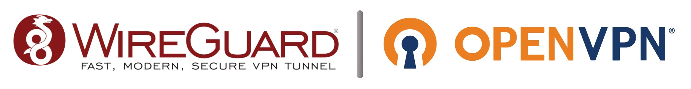

**[PIVPN.IO](https://pivpn.io)** | **[DOCUMENTATION](https://docs.pivpn.io)**


[](https://pivpn.io/)
[](https://github.com/pivpn/pivpn/graphs/commit-activity)
[](https://app.codacy.com/gh/pivpn/pivpn?utm_source=github.com&utm_medium=referral&utm_content=pivpn/pivpn&utm_campaign=Badge_Grade_Settings)
[](https://travis-ci.com/pivpn/pivpn)
[](https://travis-ci.com/pivpn/pivpn)
[](https://www.gnu.org/software/bash/)
[](https://stats.uptimerobot.com/8X64yTjrJO)
[](https://github.com/semantic-release/semantic-release)

PiVPN is a set of shell scripts developed to easily turn your Raspberry Pi (TM) into a VPN server using two free, open-source protocols:
* [WireGuard](https://www.wireguard.com/)
* [OpenVPN](https://openvpn.net)

This script's primary mission in life is to allow a user to have as cost-effective as possible VPN at home without being a technical wizard, hence the design of PiVPN to work on a Raspberry Pi ($35) with a one-command installer followed by easy management of the VPN with the 'pivpn' command.  

That being said...

PiVPN should be, bar none, the simplest and fastest way to Install and set up an extremely secure **OpenVPN** or WireGuard server on your Raspberry Pi. You won't need a guide or tutorial as PiVPN will do it all for you in a fraction of the time with hardened security settings in place by default.  

We recommend running PiVPN on the latest RaspberryPi OS Lite image in a Raspberry Pi at your home so you can VPN into your network from not secure remote locations and safely use the internet. However, you can also use PiVPN in any Cloud Provider VPS running Ubuntu or Debian to assist those with untrustworthy ISPs. Running a VPN on a server elsewhere means you can connect to the VPN from home, and because your traffic will be getting out from the cloud/VPS provider, your ISP will only see encrypted traffic. 

PiVPN should also work with most Ubuntu and Debian based distributions, including those using UFW by default instead of raw iptables.	

----
## Installation

### Method 1 (standard)

```Shell
curl -L https://install.pivpn.io | bash
```

### Method 2 (direct link)

```Shell
curl https://raw.githubusercontent.com/pivpn/pivpn/master/auto_install/install.sh | bash
```

### Method 3 (clone repo)

```Shell
git clone https://github.com/pivpn/pivpn.git
bash pivpn/auto_install/install.sh
```

### To install from Test/Development branch

```shell
curl -L https://test.pivpn.io | TESTING= bash
```

### To install from custom git url and branch (for DEV)

This is inteded to be used when testing changes during
development and **not** for standard installations.
Without this the script will always checkout the master branch.

- Git repo can be pivpn or any other git repo (e.g. a fork).
- Git branch can be specified as required

```shell
# Syntax
git clone < customgitrepourl >
bash pivpn/auto_install/install.sh --giturl < customgitrepourl > --gitbranch < customgitbranch >

# Example
git clone https://github.com/userthatforked/pivpn.git
bash pivpn/auto_install/install.sh --giturl https://github.com/userthatforked/pivpn.git --gitbranch myfeaturebranch
```

The unattended setup config also supports a custom giturl and branch.

```shell
pivpnGitUrl="https://github.com/userthatforked/pivpn.git"
pivpnGitBranch="myfeaturebranch"
```
----
## Feedback & Support

PiVPN is purely community-driven and its our objective for PiVPN to work for as many people as possible. We welcome any feedback on your experience.
Please be respectful and be aware PiVPN is maintained with volunteers free time!

### General Guidelines

* This project adheres to the Contributor Covenant [code of conduct](CODE_OF_CONDUCT.md). By participating, you are expected to uphold this code. Please report unacceptable behavior to any project maintainer.
* You can find our documentation at https://docs.pivpn.io
* Please read the pinned posts on [Github Discussions](https://github.com/pivpn/pivpn/discussions)
* Please search for similar [issues](https://github.com/pivpn/pivpn/issues?q=), you can search and apply filters that better match the problems you are facing. 
* Plase search for similar [Discussions](https://github.com/pivpn/pivpn/discussions)
* If you have not found the answer feel free to open an [issue](https://github.com/pivpn/pivpn/issues/new/choose) and we will do our best to help out
  * Please help us helping you and fill the template adequately providing the requested data **Even if it doesn't feel relevant to you**
* PiVPN team may close any Discussion/Issue without any warning if they don't follow the Guidelines

### Contact

Our prefered contact method is through [Github Discussions page](https://github.com/pivpn/pivpn/discussions)

But the you can also reach out at: 

* \#pivpn at [libera.chat](https://libera.chat) IRC network
* \#pivpn:matrix.org at [matrix.org](https://matrix.org)
* Reddit at [r/pivpn](https://www.reddit.com/r/pivpn/)

### Feature requests

Feature requests are very welcome, please do so at:

* [Feature requests](https://github.com/pivpn/pivpn/discussions/categories/feature-requests)

### Bug reports

* **Make sure the bug is not already reported** by searching on GitHub under [Issues](https://github.com/pivpn/pivpn/issues).
* If you could not find an open issue addressing the problem, [open a new one](https://github.com/pivpn/pivpn/issues/new/choose). 
  * Please provide all the data requested on the template **Even if it doesn't feel relevant to you** and, if possible, a **code sample** or an **executable test case** demonstrating the expected behavior that is not occurring.


### Pull Requests

* Open a new GitHub pull request towards the [test](https://github.com/pivpn/pivpn/tree/test) branch.
* Ensure the PR description clearly describes the problem and solution. Include the relevant issue number if applicable.
* Use the following [commit rules](https://github.com/angular/angular/blob/main/CONTRIBUTING.md#-commit-message-format).
* Use the following [code style rules](https://google.github.io/styleguide/shellguide.html). 
  * We suggest you to use the following [shfmt](https://github.com/mvdan/sh) command: `shfmt -i 2 -ci -sr -w -bn`

## Contributions

PiVPN is not taking donations but if you want to show your appreciation, then contribute or leave feedback on suggestions or improvements.

Contributions can come in all kinds of different ways! You don't need to be a developer to help out. 

* Please check the current [issues](https://github.com/pivpn/pivpn/issues) and [discussions](https://github.com/pivpn/pivpn/discussions). Maybe there is something you can help with
* [Documentation](https://github.com/pivpn/docs)! Documentation is never good enough! There is always something missing, or typos, or better English!
* Our [website](https://pivpn.io) is also Open Source. feel free to suggest any changes or improvements [here](https://github.com/pivpn/pivpn.io)
* Testing!! Run pivpn in different ways, different systems, different configurations! Let us know if you find something!
* Assisting other users in any of our official channels is also very welcomed

Still, if you consider PiVPN useful and want to Donate instead, then consider donating to:

1. [PiVPN Contributors](https://github.com/pivpn/pivpn/graphs/contributors)
2. [OpenVPNSetup](https://github.com/StarshipEngineer/OpenVPN-Setup)
3. [pi-hole.net](https://github.com/pi-hole/pi-hole)
4. [OpenVPN](https://openvpn.net)
5. [WireGuard](https://www.wireguard.com/)
6. [EFF](https://www.eff.org/)
